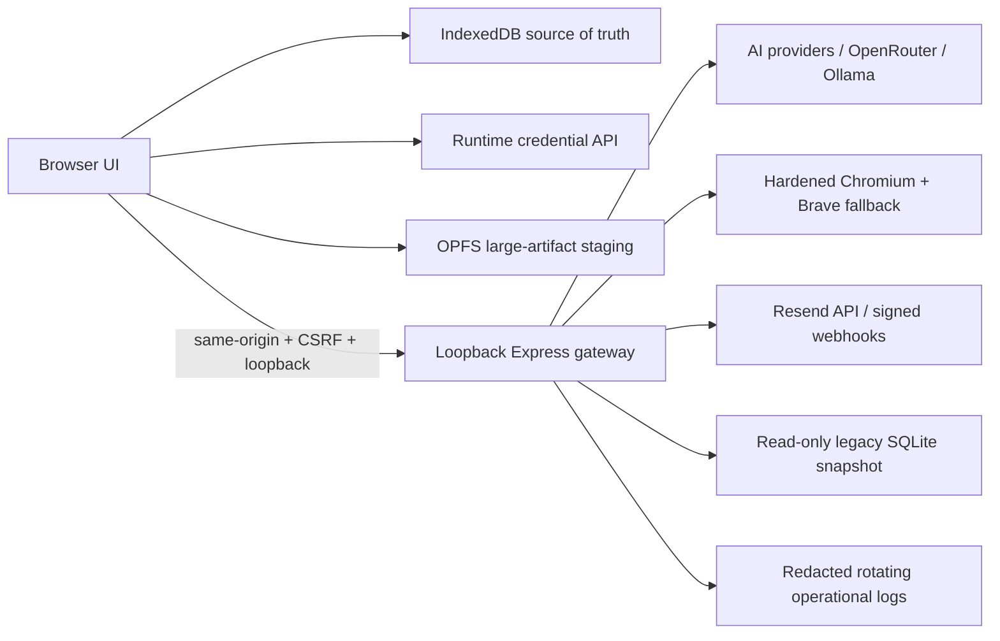

# Architecture

## Ownership boundary

The browser owns all mutable user records. Gateway requests are ephemeral. The legacy SQLite repositories remain for compatibility routes and migration only; the browser gateway import/generation routes do not write ordinary projects, records, jobs, results, edits, or exports to them.

## Browser modules

- `storage.js`: schema creation, indexes, quota/persistence status, multi-store transactions, and temporary-memory fallback.
- Runtime credential routes store provider secrets only in backend memory and return sanitized status to the browser.
- `records.js`: recursive flattening, union columns, search, sort, and display normalization.
- `templates.js`: complete variable parser, validation, rendering, and safe names.
- `splitPane.js`: pointer capture, keyboard resizing, persisted ratios, reset, and stacked responsive mode.
- `emailPipeline.js`: canonical sanitize/compose/text/standalone HTML/EML pipeline.
- `backup.js`: portable ZIP creation, validation, conflict policies, and transactional restore.
- `opfs.js`: optional staging for archives large enough to benefit from file-backed browser storage.
- `logger.js`: structured browser diagnostics with recursive secret redaction.

`public/app.js` coordinates these modules. It does not use server filesystem paths as a substitute for a browser download.

## Gateway boundaries

`/api/credentials/*` provides runtime credential status, save, clear, and connection tests while keeping credential values in backend memory only. `/api/gateway/*` provides bootstrap, ephemeral import, generation, model discovery, research, and Resend helpers. `/api/migration/legacy` provides a count/checksum snapshot without modifying SQLite. Diagnostics accept bounded redacted metadata. The server binds to loopback by default and validates same-origin state-changing requests.

The canonical unsafe-request policy lives in `src/security/requestPolicy.js` and is applied before and after body parsing by `src/middleware/security.js`. It protects every mutable `/api` route, with the signed Resend webhook as the only explicit exception.

## Canonical result model

A result retains original AI body, rendered prompt/research, addendum and signature snapshots, canonical final HTML/text, contact candidates/manual primary ID, provider/model, usage, versions, consent evidence, trash state, and delivery state. Raw and visual editors edit the same `finalEmailHtml`; save always sanitizes and writes a recoverable result version.

## Failure and recovery

- IndexedDB upgrade failures fall back to a visible temporary repository rather than an opaque crash.
- Quota errors produce actionable export/cleanup guidance.
- Running jobs found after reload become `ambiguous`; no automatic duplicate provider call is made.
- Per-record generation failures are stored and do not terminate the batch.
- Runtime provider discovery has explicit unavailable/stale/fallback states.
- Restore is validated before commit and uses one multi-store transaction (or a snapshot rollback in temporary mode).
- Shutdown drains in-flight work by flipping the lifecycle into a draining phase, aborting the shared shutdown controller, closing idle sockets, and destroying remaining sockets only after the drain deadline.
